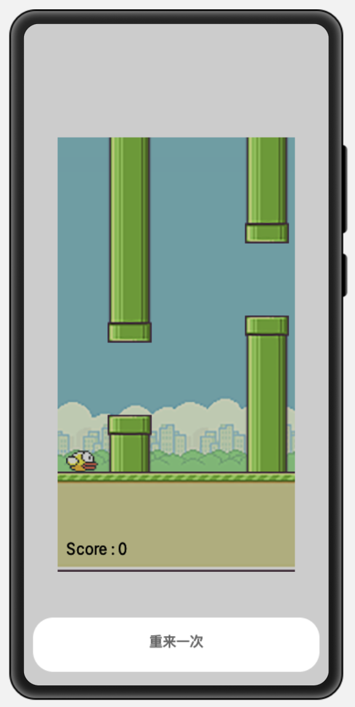
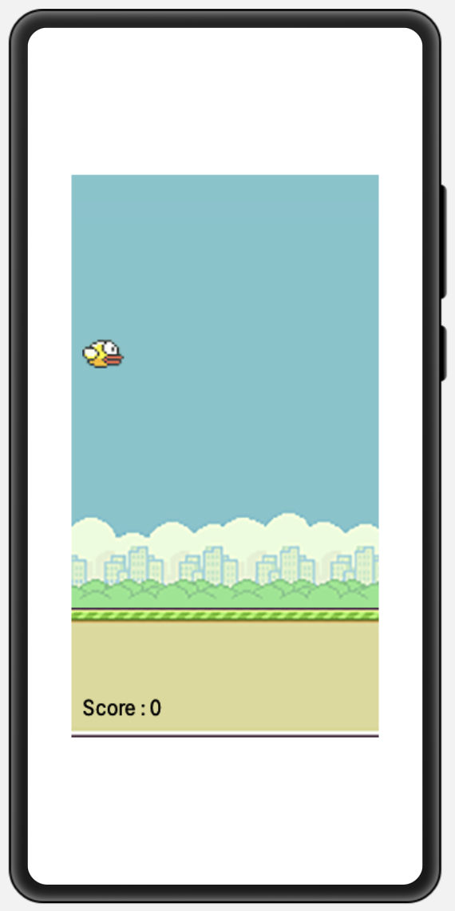

# OpenHarmonyFlappyBird

基于 Canvas 画布绘制 [FlappyBird](https://gitee.com/wscats/OpenHarmonyFlappyBird) 游戏。


在项目中引入 `<Flappy></Flappy>` 组件即可，使用方法如下：

```html
<element name="Flappy" src="./flappy//pages//index/index.hml"></element>

<div class="container">
  <Flappy></Flappy>
</div>
```

# 效果




# 开发

本项目基于 OpenHarmony 下的 JavaScript UI 框架，运行环境**请参考 [OpenHarmony 项目配置方法](https://gitee.com/isrc_ohos/ultimate-harmony-reference/blob/master/OpenHarmony%20JS%E9%A1%B9%E7%9B%AE%E5%BC%80%E5%8F%91%E6%B5%81%E7%A8%8B.md) 进行项目配置和运行。**

如果你不熟悉 OpenHarmony 的 JS 开发，**请参考该[官方文档](https://developer.harmonyos.com/cn/docs/documentation/doc-references/js-apis-overview-0000001056361791)。**

# 运行

1. 下载 [OpenHarmonyFlappyBird](https://gitee.com/wscats/OpenHarmonyFlappyBird) 项目工程，将工程导入 DevEco Studio 进行编译构建及运行调试。
2. 进行编译构建，生成一个 HAP 应用安装包，生成 HAP 应用安装包。
3. 安装运行后，即可在设备上查看应用示例运行效果，以及进行相关调试。
4. [线上体验版本](https://wscats.github.io/flappy/html/index.html)。

# 作者

| [<br /><sub>Eno Yao</sub>](https://gitee.com/wscats) |
| ------------------------------------------------------------------------------------------------------------------------------------------ |
